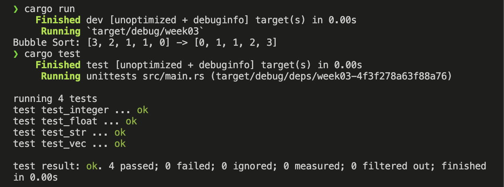

# Week03 <!-- omit in toc -->

## Table of content <!-- omit in toc -->
- [Homework](#homework)
  - [Description](#description)
  - [Result](#result)
  - [Reference](#reference)

## Homework

### Description

使用Rust语言写一个冒泡排序的算法
- 基础要求：固定类型（比如i32）的数组排序
- 提高部分：能够使用template和PartialOrd实现对任意类型的排序

### Result

### Reference

- Rust Doc
  - [Module std::cmp](https://doc.rust-lang.org/std/cmp/index.html)
    - [Trait std::cmp::PartialOrd](https://doc.rust-lang.org/std/cmp/trait.PartialOrd.html)
