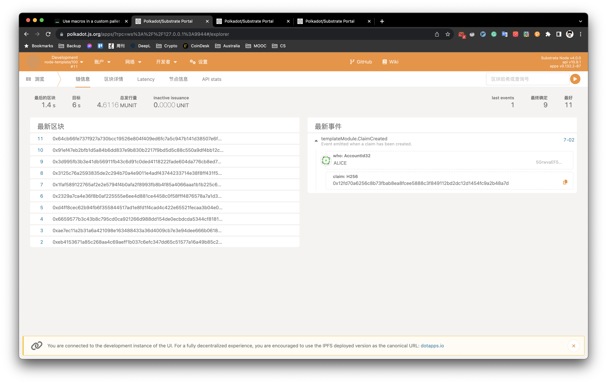
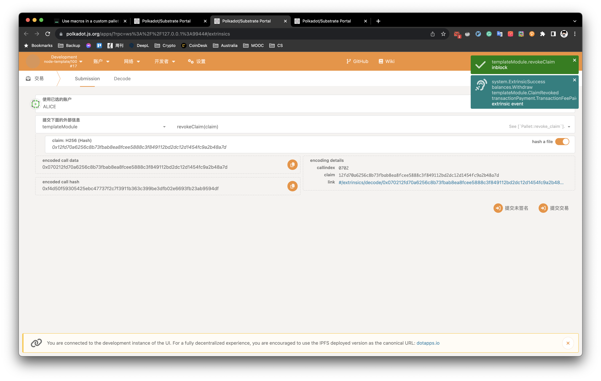
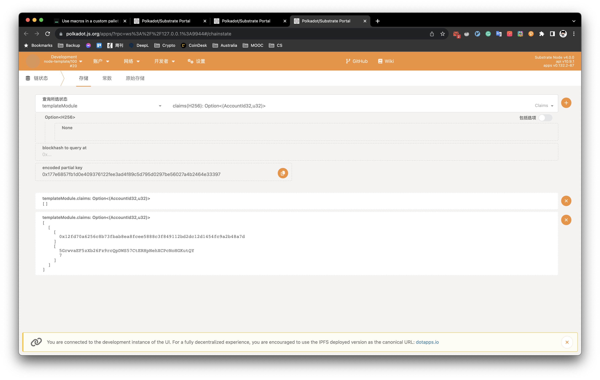
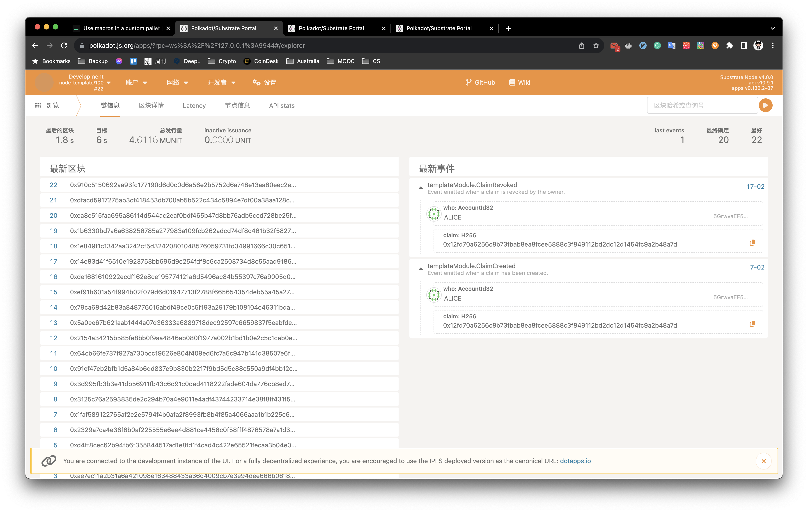
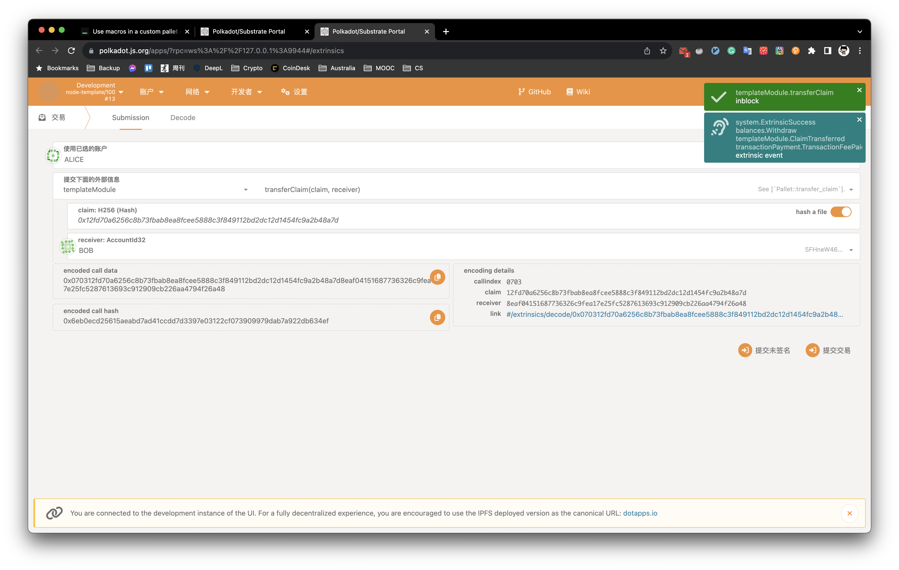
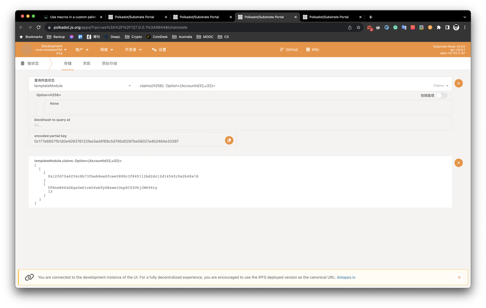

# Week05 <!-- omit in toc -->

## Table of content <!-- omit in toc -->
- [Homework A](#homework-a)
  - [Description](#description)
  - [Result](#result)
- [Homework B](#homework-b)
  - [Description](#description-1)
  - [Result](#result-1)
- [Homework C](#homework-c)
  - [Description](#description-2)
  - [Result](#result-2)
- [Reference](#reference)


## Homework A

### Description

列出3个常用的宏、3个常用的存储数据结构

### Result

Macro
1. frame_support::pallet, define a module
2. pallet::config, the configuration trait of the module
3. pallet::storage, used for each storage item

Storage
1. StorageValue: Store a single value in supported type.
2. StorageMap: Store key-value pairs.
3. StorageDoubleMap: Use two keys to index a value.

## Homework B

### Description

实现存证模块的功能，包括：创建存证；撤销存证。

### Result

```shell
$ cargo build --release
$ ./target/release/node-template --dev
```

Create




Revoke




## Homework C

### Description

为存证模块添加新的功能，转移存证，接收两个参数，一个是包含的哈希值，另一个是存证的接收账户地址。

### Result

Transfer




## Reference

Substrate Tutorial
- [Use macros in a custom pallet](https://docs.substrate.io/tutorials/build-application-logic/use-macros-in-a-custom-pallet/)